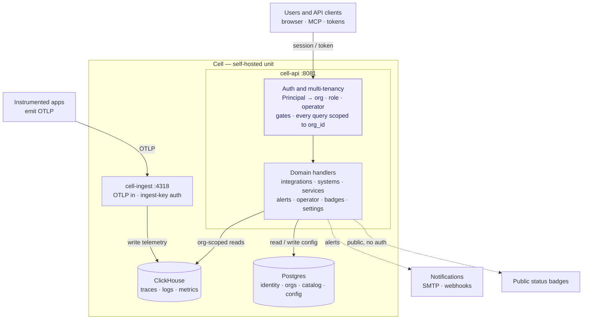

# Architecture overview

This is a short, opinionated tour of how Integration Monitor fits together.
For the *why* behind each major choice, see [`decisions.md`](decisions.md).

## System context

```
                  +---------------------+
                  | Customer's          |
                  | OTel Collectors     | ---OTLP-->  cell-ingest
                  +---------------------+

                  +---------------------+
                  | Customer's existing |
                  | Prometheus / Loki / | <--query-- cell-api
                  | ClickHouse / Jaeger |  (BYO mode, adapter layer)
                  +---------------------+

   Operator/User --- browser ---> Frontend ---> cell-api / controlplane
```

There are two flavors of customer data flow. In **push mode** the customer
ships OTLP to our `cell-ingest`, which writes traces and logs to
ClickHouse and remote-writes metrics to Prometheus (or Mimir). In **pull
mode** their telemetry stays in their existing backends and our `cell-api`
queries those backends through an adapter layer. Both modes feed the same
internal query model, so the UI and alerting engine don't care which is
in use.

## Cell architecture (as built)

The diagram below is the implemented **single cell** — the self-hosted unit.
Telemetry enters through `cell-ingest` (authenticated per-org by ingest
keys); everything else — the SPA, MCP, and API clients — goes through
`cell-api`, which resolves a `Principal` and enforces auth + multi-tenancy
before its domain handlers touch the stores. Two things differ from the
older sketch above: alerting runs **inside** `cell-api` (not a separate
`cell-alerting` service), and identity is **native** (email/password plus
per-org OIDC via `auth_providers`), not Keycloak.



The highlighted **auth and multi-tenancy** layer is the load-bearing part:
every request resolves to `(org, role, is_operator)`, passes a gate
(`RequireRole` / `RequireWriteAnywhere` / `RequireOperator`), and every store
read is filtered by `org_id`. That is what lets one cell serve multiple
organizations safely. This is a single cell — single-org in practice but
multi-org capable; the `controlplane` service only appears in a multi-cell
SaaS topology, where it maps tenants to cells.

## Components

```
   +----------------------------+   +-----------------------------+
   |        Control plane       |   |             Cell             |
   |  (one per SaaS deployment) |   |  (one per tenant or shared)  |
   +----------------------------+   +-----------------------------+
   | controlplane               |   | cell-ingest (OTLP receiver) |
   |   - orgs, users, members   |   | cell-api    (queries + UI)  |
   |   - cell registry          |   | cell-alerting (rule engine) |
   |   - billing                |   |                              |
   | Postgres                   |   | ClickHouse (logs, traces)   |
   | Keycloak (OIDC)            |   | Prometheus / Mimir (metrics)|
   |                            |   | (frontend served by cell-api)|
   | cell-controller            |   +-----------------------------+
   |   - provisions cells in K8s|
   +----------------------------+
```

The on-premise distribution is exactly the cell. There is no control
plane to install: the customer's own identity provider plugs into
Keycloak (or directly into the cell services) and the cell is configured
as a single-tenant.

## Data flow inside a cell

1. **Ingest.** `cell-ingest` exposes an OTLP gRPC/HTTP endpoint. Incoming
   traces and logs are written to ClickHouse. Metrics are forwarded via
   Prometheus remote-write. The receiver validates tenant identity from
   the bearer token before writing.

2. **Query.** `cell-api` exposes a REST/JSON API to the frontend. For
   each tenant it knows which **adapter** to call for each signal —
   ClickHouse for managed-mode traces/logs, PromQL for metrics, Loki for
   BYO logs, and so on. The API normalizes results into a common
   internal model before returning them.

3. **Integration scoping.** Integrations are defined as matcher rules
   over span / log / metric attributes (e.g. `service.name ~ "^brx"`).
   `cell-api` applies these rules at query time, so changes are
   immediately reflected without backfill.

4. **Alerting.** `cell-alerting` evaluates rules on a polling cadence.
   For each rule it builds the appropriate backend query through the
   same adapter layer the API uses, evaluates the condition, transitions
   alert state, and emits notification jobs. The notification subsystem
   pulls jobs from a durable queue and dispatches via the configured
   channel plugins (email, webhook, AMQP, Kafka in v1).

## Plugin contracts

The plugin interface — currently `Notifier`, later `Adapter` — lives in
the `plugins/` module under Apache 2.0. The contract is intentionally
small (configure, validate, describe, send / query) and is designed to be
exposable over gRPC later using the HashiCorp `go-plugin` pattern, which
will allow third parties to ship plugins as separate processes without
forking the core. v1 ships only in-binary implementations.

## Provisioning

`cell-controller` runs in the control plane's cluster. When the control
plane decides a tenant needs a new dedicated cell (e.g. on signup to the
enterprise tier), it asks the controller to apply the cell Helm chart
with the tenant's parameters, then registers the cell's endpoints in the
control plane's directory. For shared cells, the controller just adds
the tenant to an existing cell's roster.

## What is *not* yet decided

- The exact API style between frontend and `cell-api` (REST vs. gRPC-web
  vs. tRPC-style). Defaulting to REST/JSON for now; revisit when the
  topology view forces us to think about streaming.
- The internal protobuf vs. JSON representation between services.
- Whether `cell-alerting` is a separate process or a library inside
  `cell-api`. Starting as a separate process for clean operational
  boundaries.
- Storage of the alert dispatch queue. Postgres-backed queue
  (e.g. River, pgmq) is the leading candidate over Redis or NATS for
  durability without an extra dependency.

These will be resolved as the implementation forces the issue.
